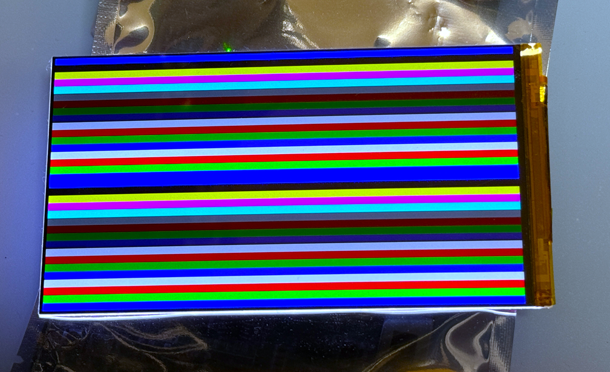

# Possibly the most best Verilog-Based DPI and MIPI-DSI FPGA Examples

## If this project is constructive, welcome to donate a drink to PayPal.

or 

paypal.me/briansune

### This project aimed to support MIPI or DPI I/F off-the-shelf LCD/TFT display.

### Expected FPGA Support

1) In the follow examples, Xilinx 7 series and ultrascale+ series should able to support as much MIPI display as possible.
2) Xilinx 7 would require resistor network to convert LVDS to SLVS.
3) Successful cases are demonstrated on three Xilinx FPGA families "Kintex", "Artix", and "ZYNQ Ultrascale+".
4) It is confident to say this pure Verilog-based MIPI DSI design is stabled and matured enough to work on.

### Read First !

Please study the example 5.5" LCD with LCD driver HX8399C.

This example provided detail resistor-network vs MC20902 design, which is aligned with Xilinx doc. "XAPP894".

The resistor-network is not re-simulated via IBIS simulator, so if you really concern on SI then do it as your will.

### Video Test Pattern Top Block-Diagram

### Display Examples

|Idx|Display|Status|I/F|Driver IC|Lane #|Mode|Project Link|Tested FPGA|IDE|FPS|W,H,BPP|
|:-:|:-:|:-:|:-:|:-:|:-:|:-:|:-:|:-:|:-:|:-:|:-:|
|  1 |      | 🟢 DONE    | MIPI | GC9C01       | 1   | C   | [ZJY132R-IG03](https://github.com/briansune/Kintex-7-MIPI-DSI-1.32-inch-LCD)        | K7,ZU  | Vivado 2020.2 | 60 |    360,360,[24]     |
|  2 |       | 🟢 DONE    | MIPI | ST7797       | 1   | V   | [DT160BQ-C12-01](https://github.com/briansune/Kintex-7-MIPI-DSI-1.6-inch-LCD)       | K7     | Vivado 2020.2 | 60 |    400,400,[16,24]  |
|  3 |      | 🟢 DONE    | MIPI | ST7701S      | 2   | V   | [CY300H4003](https://github.com/briansune/Kintex-7-MIPI-DSI-2.95-inch-LCD)          | K7     | Vivado 2020.2 | 60 |    360,640,[16,24]  |
|  4 |      | 🟢 DONE    | MIPI | ST7701S      | 2   | V   | [T397B5-C24-02](https://github.com/briansune/Artix-Kintex-7-MIPI-DSI-3.97-inch-LCD) | A7,K7  | Vivado 2020.2 | 60 |    480,800,[16,24]  |
|  5 |       | 🟢 DONE    | MIPI | NT35516      | 2   | V/C | [INX4.5](https://github.com/briansune/Artix-Kintex-7-MIPI-DSI-4.5-inch-LCD)         | A7,K7  | Vivado 2020.2 | 60 |    540,960,[16,24]  |
|  6 |       | 🟢 DONE    | MIPI | HX8399C      | 4   | V   | [AML055T012A](https://github.com/briansune/Kintex-7-MIPI-DSI-5.5-inch-LCD)          | K7     | Vivado 2020.2 | 60 |  1080,1920,[16,24]  |
|  7 |  | 🟢 DONE    | MIPI | ST7701S      | 2   | V   | [HXR397HS25PIN](https://github.com/briansune/Kintex-7-MIPI-DSI-3.97-inch-LCD-B)     | K7     | Vivado 2020.2 | 60 |    480,800,[16,24]  |
|  8 |         | 🟢 DONE    | MIPI | R61322       | 4   | V   | [DXQ5D0039](https://github.com/briansune/Kintex-7-MIPI-DSI-5-inch-LCD)              | K7     | Vivado 2020.2 | 60 |  1080,1920,[24]     |
|  9 |     | 🟢 DONE    | MIPI | JD9522Z      | 4   | V   | [HD55017C31](https://github.com/briansune/Kintex-7-MIPI-DSI-5.5-inch-LCD-C)         | K7     | Vivado 2020.2 | 60 |  1080,1920,[16,24]  |
| 10 |      | 🟢 DONE    | MIPI | JD9365DA-H3  | 4   | V   | [MX101BA13](https://github.com/briansune/Kintex-7-MIPI-DSI-10.1-inch-LCD)           | K7     | Vivado 2020.2 | 60 |   800,1280,[16,24]  |
| 11 |       | 🟢 DONE    | MIPI | JD9365DA-H3  | 3   | V   | [HD34003C39](https://github.com/briansune/Kintex-7-MIPI-DSI-3.4-inch-LCD)           | K7     | Vivado 2020.2 | 60 |    800,800,[16,24]  |
| 12 |    | 🟢 DONE    | MIPI | ST7701S      | 2   | V   | [HXR030HSD40PIN](https://github.com/briansune/Kintex-7-MIPI-DSI-2.95-inch-LCD-B)    | K7     | Vivado 2020.2 | 60 |    360,640,[16,24]  |
| 13 |    | 🟢 DONE    | MIPI | R63419       | 4,4 | V   | [LS055R1SX04](https://github.com/briansune/Kintex-7-MIPI-DSI-5.5-inch-2K-LCD)       | K7     | Vivado 2020.2 | 60 | 720x2,2560,[16,24]  |
| 14 |    | 🟡 1080p   | MIPI | NT35950      | 4,4 | V   | [AML055D105G](https://github.com/briansune/Kintex-7-MIPI-DSI-5.5-inch-4K-LCD)       | K7     | Vivado 2020.2 | 60 |  1080,1920,[24]     |
| 15 |       | 🟢 DONE    | MIPI | GC9702P      | 4   | V   | [HD69002C31](https://github.com/briansune/Kintex-7-MIPI-DSI-6.9-inch-LCD)           | K7     | Vivado 2020.2 | 60 |   720,1440,[24]     |
| 16 |         | 🟢 DONE    | DPI  | AT070N92/94  | x   | V   | [AT070N92/94](https://github.com/briansune/max-II-cpld-sdram-tft-driver)            | MAX II | Quartus       | 60 |    800,480,[24]     |
| 17 |      | 🟢 DONE    | DPI  | AT070N92/94  | x   | V   | [AT070N92/94](https://github.com/briansune/Spartan_3_sdram_ftf_driver)              | S3     | ISE 14.7      | 60 |    800,480,[24]     |
